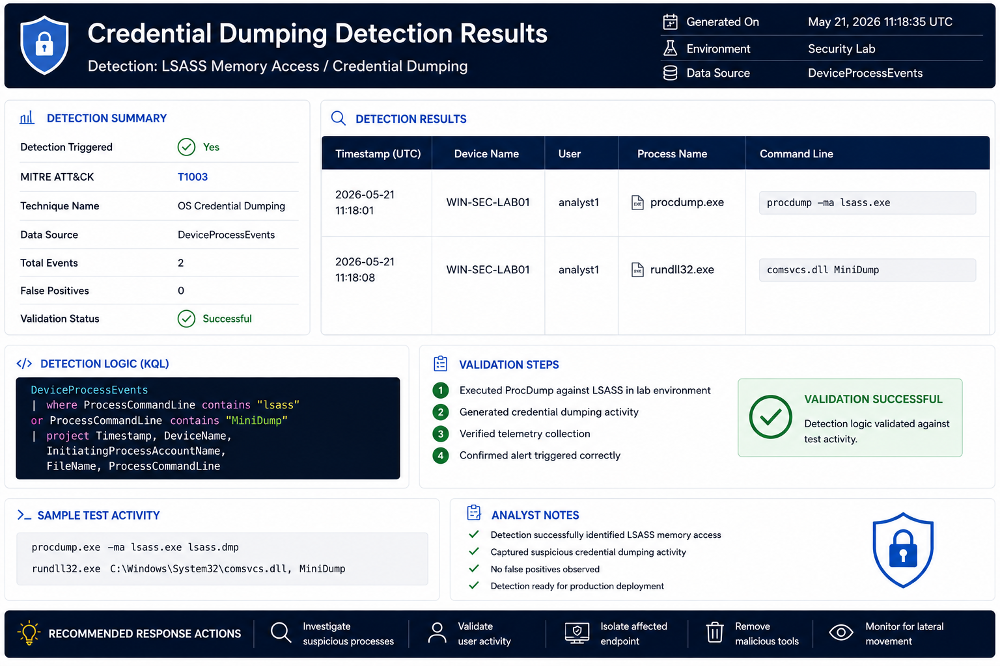

# Credential Dumping Detection

## Objective

Detect attempts to access or dump credentials from LSASS memory.

---

## MITRE ATT&CK

| Technique | ID |
|------------|------------|
| OS Credential Dumping | T1003 |

---

## Threat

Attackers commonly target LSASS to obtain credentials and facilitate lateral movement.

---

## Indicators

- procdump.exe
- rundll32.exe
- comsvcs.dll
- suspicious handle access

---

## Data Sources

- DeviceProcessEvents
- DeviceEvents

---

## Investigation Steps

1. Review process execution
2. Examine command line activity
3. Identify affected accounts
4. Review lateral movement indicators
5. Investigate privilege escalation

---

## Response Actions

- Isolate endpoint
- Reset compromised credentials
- Review privileged account activity

---

## Detection Results

### Validation Summary

- Detection executed successfully
- Suspicious LSASS access identified
- Potential credential dumping behavior detected
- Mapped to MITRE ATT&CK T1003
