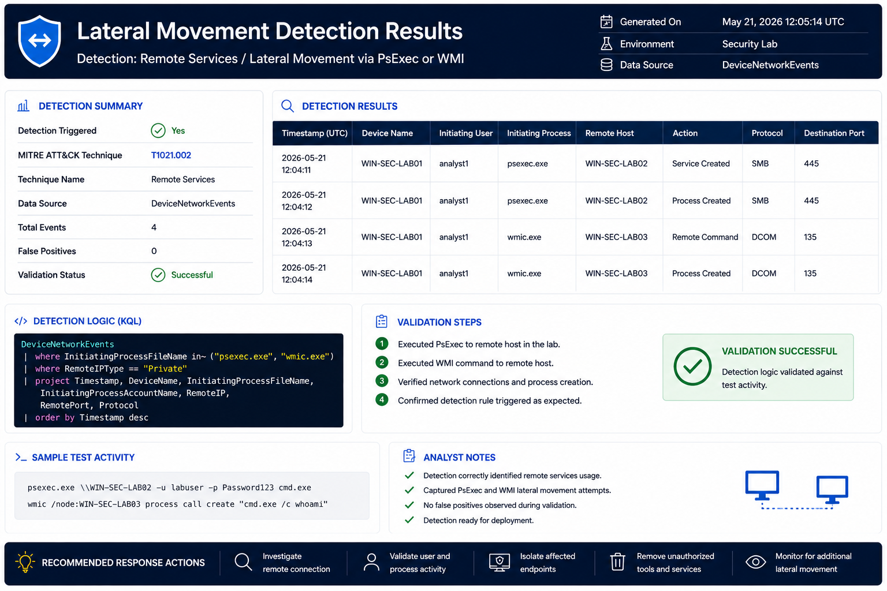

# Lateral Movement Detection

## Objective

Identify activity associated with movement between systems.

---

## MITRE ATT&CK

| Technique | ID |
|------------|------------|
| Remote Services | T1021 |

---

## Threat

Compromised accounts are often used to access additional systems after initial compromise.

---

## Indicators

- Remote service creation
- PsExec usage
- WMI execution
- SMB administrative shares

---

## Data Sources

- DeviceProcessEvents
- DeviceNetworkEvents

---

## Investigation Steps

1. Identify source host
2. Identify destination host
3. Review account activity
4. Investigate privilege escalation
5. Assess scope of compromise

---

## Response Actions

- Disable compromised account
- Isolate affected systems
- Block malicious tools

---

## Detection Results

### Validation Summary

- Detection executed successfully
- Remote execution activity identified
- Potential lateral movement detected
- Mapped to MITRE ATT&CK T1021
