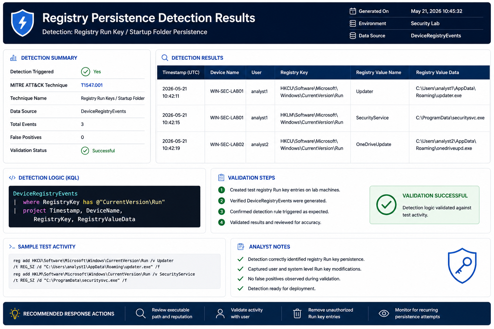

# Registry Persistence Detection

## Objective

Detect registry modifications commonly used to establish persistence on Windows systems.

---

## MITRE ATT&CK

| Technique | ID |
|------------|------------|
| Registry Run Keys / Startup Folder | T1547.001 |

---

## Threat

Attackers frequently create or modify Run keys to automatically execute malware at user logon.

---

## Data Sources

- DeviceRegistryEvents

---

## Registry Keys Monitored

HKCU\Software\Microsoft\Windows\CurrentVersion\Run

HKLM\Software\Microsoft\Windows\CurrentVersion\Run

---

## Investigation Steps

1. Review modified registry key
2. Identify initiating process
3. Review associated executable
4. Check persistence mechanisms
5. Investigate affected endpoints

---

## Response Actions

- Remove malicious key
- Remove associated payload
- Review additional persistence mechanisms
- Isolate host if necessary

---

## Detection Results

### Validation Summary

- Detection executed successfully
- Registry Run Key modification identified
- Persistence mechanism detected
- Mapped to MITRE ATT&CK T1547.001
