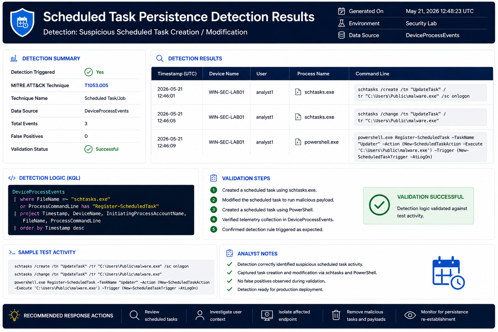

# Scheduled Task Persistence Detection

## Objective

Detect malicious scheduled task creation used for persistence.

---

## MITRE ATT&CK

| Technique | ID |
|------------|------------|
| Scheduled Task | T1053 |

---

## Threat

Scheduled tasks are frequently used to maintain persistence and execute payloads automatically.

---

## Data Sources

- DeviceProcessEvents

---

## Indicators

- schtasks.exe
- task creation
- task modification

---

## Investigation Steps

1. Review task name
2. Review scheduled action
3. Review creating process
4. Determine persistence purpose

---

## Response Actions

- Remove malicious task
- Remove associated payload
- Investigate endpoint activity

---

## Detection Results

### Validation Summary

- Detection executed successfully
- Suspicious scheduled task creation identified
- Persistence mechanism detected
- Mapped to MITRE ATT&CK T1053
